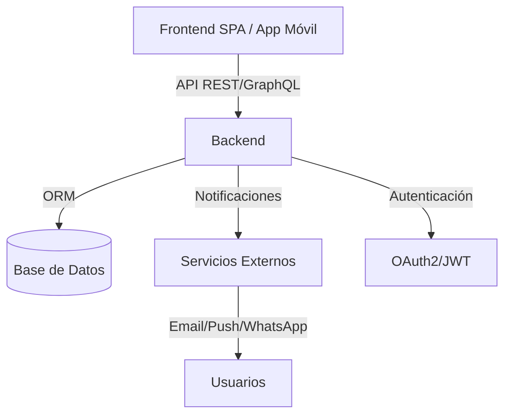
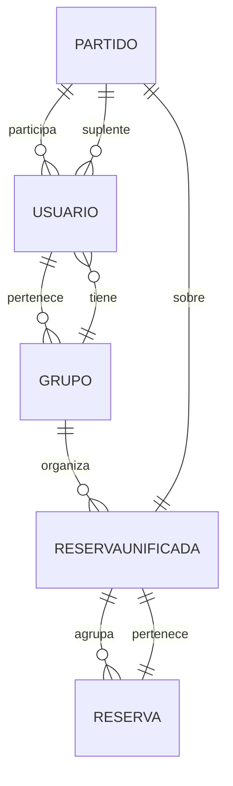

# Documento Técnico: Backend

## 1. Introducción
Este documento describe la arquitectura, tecnologías, modelos de datos, APIs y lógica de negocio del backend para el sistema de gestión de grupos y reservas deportivas. El objetivo es proporcionar una base robusta, escalable y segura que cumpla con los requisitos funcionales y técnicos definidos.

## 2. Arquitectura General
- Arquitectura modular basada en servicios (monolito escalable o microservicios según el volumen esperado).
- Backend desacoplado del frontend, expone API RESTful y/o GraphQL.
- Integración con sistemas de notificaciones y autenticación centralizada.
- Persistencia en base de datos relacional (PostgreSQL/MySQL) o NoSQL (MongoDB) según necesidades.

### Diagrama de Arquitectura


## 3. Tecnologías y Herramientas

Las tecnologías y herramientas recomendadas para el desarrollo del backend son:

- **Lenguaje y Framework:** Node.js (NestJS)
- **Base de datos:** PostgreSQL, MySQL o MongoDB
- **ORM:** TypeORM, Prisma
- **Autenticación:** JWT, OAuth2, integración con Google, Facebook, Apple, Microsoft
- **Notificaciones:** SendGrid (email), Firebase Cloud Messaging (push), Twilio (WhatsApp)
- **Contenerización y despliegue:** Docker, CI/CD (GitHub Actions, GitLab CI)
- **Monitorización:** Prometheus, Grafana
- **Logs:** ELK Stack (Elasticsearch, Logstash, Kibana)

## 4. Modelos de Datos
El backend implementará los siguientes modelos, alineados con la definición funcional y técnica:
### Usuario
- id (PK)
- nombre
- email
- contraseña (hash)
- deportes_preferidos

### Grupo
- id (PK)
- nombre
- administradores (array de id_usuario)
- miembros (array de id_usuario)

### ReservaUnificada
- id (PK)
- fecha
- grupo_id (FK)
- plazas_totales

### Reserva
- id (PK)
- reserva_unificada_id (FK)
- grupo_id (FK)
- fecha
- hora
- pistas (array o número de plazas)
- creador_id (FK)

### Partido/Eventos
- id (PK)
- reserva_unificada_id (FK)
- deporte
- participantes (array de id_usuario)
- suplentes (array de id_usuario)

### Diagrama Entidad-Relación



## 5. API REST/GraphQL
El backend expondrá endpoints para la gestión de usuarios, grupos, reservas, reservas unificadas y partidos/eventos. Ejemplo de estructura REST:

- `/api/auth` (registro, login, autenticación OAuth2/JWT)
- `/api/usuarios` (CRUD de usuarios)
- `/api/grupos` (CRUD de grupos, gestión de miembros y administradores)
- `/api/reservas-unificadas` (crear, consultar, modificar reservas unificadas)
- `/api/reservas` (crear, consultar, modificar reservas individuales)
- `/api/partidos` (gestión de partidos/eventos, inscripción de participantes y suplentes)
- `/api/notificaciones` (envío y gestión de notificaciones)

Cada endpoint validará roles y permisos, y gestionará la lógica de negocio descrita en el documento funcional.

## 6. Lógica de Negocio
La lógica de negocio del backend cubre los siguientes aspectos clave:

### 6.1. Gestión de Usuarios
- Registro y autenticación segura (JWT/OAuth2).
- Edición de perfil y deportes preferidos.
- Validación de pertenencia a grupos.

### 6.2. Gestión de Grupos
- Creación y edición de grupos.
- Gestión de miembros y administradores.
- Permitir que usuarios pertenezcan a varios grupos.

### 6.3. Gestión de Reservas y Reservas Unificadas
- Creación de reservas individuales siempre asociadas a una reserva unificada.
- Unificación de reservas para sumar plazas y gestionar eventos conjuntos.
- Modificación y consulta de reservas y reservas unificadas.

### 6.4. Gestión de Partidos/Eventos
- Creación de partidos/eventos sobre reservas unificadas.
- Inscripción de participantes y suplentes.
- Lógica de reemplazo automático de suplentes.

### 6.5. Notificaciones
- Envío de notificaciones automáticas por email, push y WhatsApp (opcional).
- Avisos de plazas libres, cambios y reemplazos.

## 7. Seguridad y Autenticación
- Autenticación centralizada (JWT/OAuth2).
- Roles y permisos: administrador, usuario.
- Validación de acceso a recursos según rol.
- Cifrado seguro de contraseñas (bcrypt).
- Protección de datos personales y cumplimiento de privacidad.

## 8. Ejemplos de Endpoints REST
```http
POST /api/auth/register
POST /api/auth/login
GET /api/usuarios/{id}
POST /api/grupos
POST /api/grupos/{id}/miembros
POST /api/reservas-unificadas
POST /api/reservas
POST /api/partidos
POST /api/partidos/{id}/inscripcion
POST /api/partidos/{id}/suplentes
POST /api/notificaciones
```

## 9. Integración con Notificaciones
- Integración con servicios externos (SendGrid, Firebase, Twilio).
- Gestión de plantillas y eventos de notificación.

## 10. Despliegue y Mantenimiento
- Contenerización con Docker.
- CI/CD para despliegue automatizado.
- Monitorización (Prometheus, Grafana).
- Logs centralizados (ELK Stack).
- Backups periódicos.

## 11. Diagramas Técnicos
Ver documento técnico general para diagramas de arquitectura y entidad-relación.

## 12. Flujos de Usuario

### 12.1. Registro y Autenticación de Usuario
1. El usuario puede registrarse y autenticarse de dos formas:
	- Mediante email/contraseña accediendo al endpoint `/api/auth/register` y enviando sus datos.
	- Mediante redes sociales (Google, Facebook, Apple, Microsoft) accediendo al endpoint `/api/auth/{proveedor}` y autorizando el acceso.
2. El backend valida los datos, crea el usuario y almacena la contraseña cifrada o vincula la cuenta social.
3. El usuario inicia sesión usando email/contraseña (`/api/auth/login`) o mediante el proveedor social, recibiendo un token JWT/OAuth2.
4. El token se usa para autenticar y autorizar todas las operaciones posteriores.

### 12.2. Creación y Gestión de Grupos
1. Un usuario autenticado accede al endpoint de creación de grupo (`/api/grupos`).
2. El backend crea el grupo y asigna al usuario como administrador.
3. El administrador puede invitar y gestionar miembros y otros administradores.
4. Los usuarios pueden pertenecer a varios grupos.

### 12.3. Creación de Reservas y Reservas Unificadas
1. Un administrador accede al endpoint de creación de reserva unificada (`/api/reservas-unificadas`).
2. Se crean una o varias reservas individuales asociadas a la reserva unificada (`/api/reservas`).
3. El backend suma las plazas y gestiona la relación entre reservas y reserva unificada.
4. Se pueden modificar y consultar reservas y reservas unificadas.

### 12.4. Inscripción a Partidos/Eventos y Gestión de Suplentes
1. Los usuarios ven las plazas disponibles en la reserva unificada y acceden al endpoint de inscripción (`/api/partidos/{id}/inscripcion`).
2. Si las plazas principales están llenas, pueden inscribirse como suplentes (`/api/partidos/{id}/suplentes`).
3. El backend gestiona la lista de participantes y suplentes, y realiza reemplazos automáticos si hay bajas.

### 12.5. Envío de Notificaciones
1. El backend detecta eventos relevantes (nueva reserva, cambios, plazas libres, reemplazos).
2. Se envían notificaciones automáticas por email, push o WhatsApp según la configuración del usuario.
3. El sistema registra el estado y entrega de las notificaciones.
