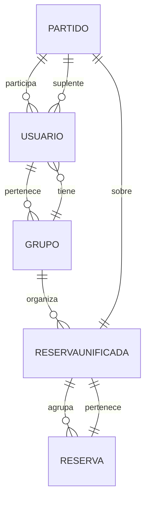
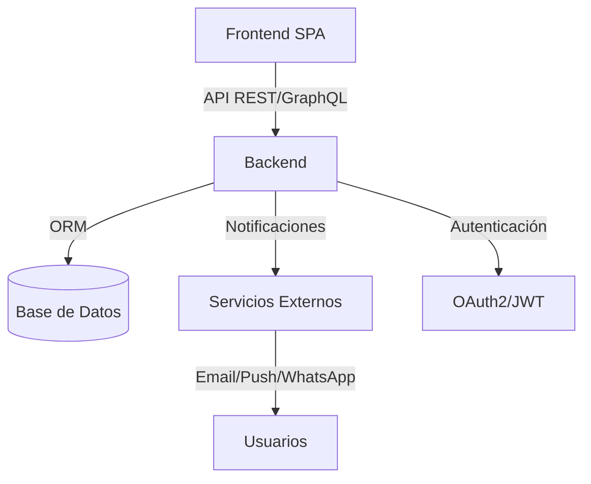
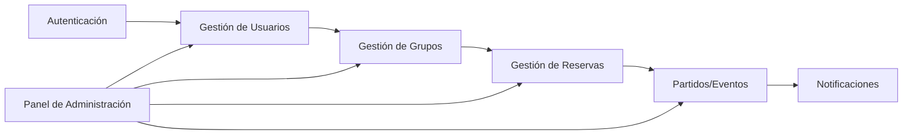

# Documento Técnico: Sistema de Gestión de Grupos y Reservas Deportivas

## 1. Objetivo del Proyecto
Desarrollar una plataforma para gestionar grupos deportivos, reservas de pistas/espacios y la inscripción de participantes, eliminando la dependencia de WhatsApp y facilitando la organización, comunicación y flexibilidad para distintos deportes y formatos.

## 2. Estructura del proyecto

```
root/
	backend/        # Código fuente y tests del backend (API, lógica de negocio, modelos)
	web/            # Código fuente y tests de la app web (SPA)
	mobile/         # Código fuente y tests de la app móvil (PWA o nativo)
	docs/           # Documentación técnica y funcional
	scripts/        # Scripts de despliegue, migraciones, utilidades
	.github/        # Workflows de CI/CD
	docker/         # Configuración de contenedores
	shared/         # Código compartido (modelos, utilidades, tipos)
	README.md       # Descripción general del proyecto
```

**Buenas prácticas:**
- Mantener carpetas separadas y bien documentadas.
- Usar control de versiones (Git) y ramas para desarrollo/producción.
- Integrar CI/CD para pruebas y despliegue automatizado.
- Compartir modelos y utilidades en `/shared` para evitar duplicidad.
- Documentar dependencias y procesos en `/docs` y `README.md`.


## 3. Alcance Técnico

### 3.1. Gestión de Usuarios
- Registro y autenticación de usuarios (OAuth2/JWT, cifrado seguro).
- Perfil de usuario: nombre, contacto, deportes preferidos.
- Un usuario puede pertenecer a varios grupos.

### 3.2. Gestión de Grupos
- Creación y administración de grupos deportivos.
- Varios administradores por grupo.
- Invitación y gestión de miembros.

### 3.3. Gestión de Reservas
- Creación de reservas para pistas/espacios en fechas y horas específicas.
- Una reserva puede tener uno o más espacios/pistas (n plazas).
- Asignación de participantes principales y suplentes.
- Unificación de reservas para el mismo día (flexibilidad de plazas):
	- Se permite agrupar reservas mediante un campo `reserva_padre_id` o una tabla de agrupación (`ReservaUnificada`).
	- Al unificar, se suman las plazas y se gestionan los participantes y suplentes como un solo evento.
	- La interfaz mostrará el evento unificado, permitiendo inscribirse sobre el total de plazas.
	- El sistema gestiona suplentes y reemplazos automáticos en el conjunto de reservas unificadas.

### 3.4. Inscripción a Partidos/Eventos
- Los usuarios pueden apuntarse como participantes o suplentes.
- Visualización de plazas disponibles y suplentes.
- Lógica para reemplazo automático si hay baja o plazas libres.
- Notificaciones automáticas (email, push, WhatsApp opcional).

### 3.5. Adaptabilidad a Otros Deportes
- Configuración de número de participantes por partido/evento según el deporte.
- Soporte para diferentes reglas y dinámicas de inscripción.

## 4. Requerimientos Técnicos
- Plataforma web (SPA: React, Vue.js, Angular).
- Backend: Node.js (Express/NestJS) o Python (Django/FastAPI).
- Base de datos relacional (PostgreSQL/MySQL) o NoSQL (MongoDB).
- Sistema de notificaciones (SendGrid, Firebase, Twilio).
- Seguridad y privacidad de datos.
- Despliegue con Docker, CI/CD, monitorización y backups.

## 5. Modelos de Datos
**Usuario:** id, nombre, email, contraseña (hash), deportes_preferidos
**Grupo:** id, nombre, administradores (array de id_usuario), miembros (array de id_usuario)

**ReservaUnificada:** id, fecha, grupo_id, plazas_totales
**Reserva:** id, reserva_unificada_id, grupo_id, fecha, hora, pistas (array o número de plazas), creador_id
**Partido/Eventos:** id, reserva_unificada_id, deporte, participantes (array de id_usuario), suplentes (array de id_usuario)

## 6. Flujos y Casuística
- Reservas múltiples y unificadas en un día.
- Inscripción de participantes y suplentes.
- Reemplazo automático de suplentes.
- Visualización de plazas y suplentes en la interfaz.
- Usuarios en varios grupos y grupos con varios administradores.

## 7. Seguridad y Privacidad
- Roles y permisos: administrador, usuario.
- Gestión segura de datos y privacidad.

## 8. Despliegue y Mantenimiento
- Docker, CI/CD, monitorización (Prometheus, Grafana), logs centralizados (ELK Stack), backups.

## 9. Diagramas Técnicos


### 9.1. Diagrama Entidad-Relación (ER)


### 9.2. Diagrama de Arquitectura


### 9.3. Diagrama de Módulos

